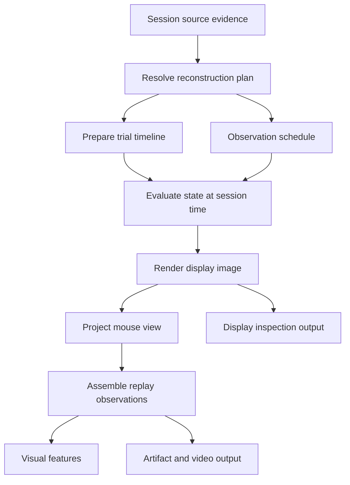

# Visual Replay Internal Architecture

## 1. Purpose and status

This proposed architecture implements the source-derived functional reconstruction defined in `spec.md`. The specification remains authoritative. This document records the internal responsibility boundaries needed to keep source interpretation, task state, display mapping, scene projection, and output timing consistent.

The design may replace the existing implementation. It does not claim that these boundaries already exist or that historical renderer behavior has been verified through execution. Concrete APIs and storage schemas belong in `interface.md` when implemented.

## 2. Internal data flow

Replay uses one preparation stage and a deterministic observation pipeline. A coordinator connects the stages but does not contain task, movement, or projection rules.

| Responsibility | Owns | Produces |
| --- | --- | --- |
| Evidence resolution | Applicable task/rendering behavior, parameter precedence, units, explicit fallbacks | Resolved reconstruction plan with evidence and assumptions |
| Trial reconstruction | Event interpretation, wheel coupling, movement, visibility, freeze and offset | Trial timeline and stimulus state at a requested session time |
| Observation scheduling | Requested time domain, source observation times, timing classification | Ordered observation times and their timing provenance |
| Display rendering | Carrier, envelope/aperture, contrast, background, task-to-display mapping and clipping | Display-space image |
| Scene projection | Physical screen placement and fixed mouse-centered camera | Mouse-perspective image |
| Output assembly | Observation identity, timing, validity, coverage and provenance | Public observation stream and optional persisted artifacts |

These are logical responsibilities, not a requirement for a class hierarchy or one module per row. Keep them in a single component, with ordinary functions and explicit records where sufficient.

## 3. Resolve evidence before rendering

Consume session evidence through the public `session-data` boundary. Replay interprets that evidence; it does not independently acquire datasets or choose ONE/Alyx cache and revision policies.

Preparation resolves three distinct groups of information:

- **Source behavior:** the applicable task transitions, wheel coupling, parameter meanings, and historical display-rendering semantics.
- **Trial inputs:** original identity, events, wheel evidence, effective stimulus parameters, and any trial-specific overrides.
- **Scene and observation configuration:** physical screen/viewpoint assumptions, image dimensions, requested time domain, and observation scheduling policy.

Use a small, explicit behavior profile for each materially supported source behavior. A profile records the behavioral rules and their evidence; it need not represent every historical package version. Do not introduce a general renderer plugin framework. A source-derived production implementation is sufficient; executing the historical runtime is not an architectural dependency.

Resolve parameter precedence once, before evaluating frames, following the specification's evidence order. Retain each effective value or derivation with its units, evidence source, and recovered or assumed status. Distinguish the historical source used as a behavioral reference from evidence that it applies to a particular session.

Renderers receive the resolved plan and do not invent defaults. Contradictory essential evidence is an explicit failure or invalid result. Missing optional calibration may use a documented approximation without invalidating an otherwise functional replay.

Synthetic properties such as unrecovered phase are derived from a recorded seed policy and stable session/trial identity. Trial filtering, batch size, and processing order must not change them.

## 4. One owner for task state and movement

Prepare the task timeline independently of the requested frame cadence. Preserve distinct event meanings, including show/onset, closed-loop activation, freeze, response, feedback, and hide/offset where applicable. The selected behavior profile determines which events cause transitions and how simultaneous events are ordered.

The trial evaluator is the sole owner of wheel-driven stimulus movement. It resolves the coupling origin, wheel baseline, gain, sign, and applicable movement interval, then produces the resulting stimulus position in declared task coordinates. It supports outward and error trajectories. Clamps or other motion restrictions are applied only when justified by the selected task behavior.

Wheel interpolation and admissible gaps are explicit parts of movement reconstruction. They must respect source coverage; extrapolation across unavailable movement evidence must not silently produce a valid position. This reconstructs stimulus state from wheel evidence and does not perform visual-neural alignment.

At freeze, evaluate the position at the freeze event using the same movement semantics, then retain that position until the next applicable transition. Do not freeze at the last emitted video frame or assume feedback is the freeze event. If the task remains visible after movement stops, continue rendering the frozen stimulus until offset.

The evaluator returns visibility, position, effective visual parameters, and reconstruction status. Hidden content is a valid blank display only when source evidence establishes that state. Unknown visibility is unavailable information.

Evaluating a trial at the same session time must give the same state regardless of frame request order, batch boundaries, or output FPS. An implementation may precompute trajectories or cache results, but it must process relevant events even when no requested frame lands on them. Display rendering and scene projection never consume raw wheel data or reapply movement.

## 5. Separate the two geometric transformations

### Display reconstruction

The display renderer consumes resolved stimulus state and the source display profile. It applies the source-derived carrier, envelope/aperture, phase, contrast, background, clipping, and task-to-display mapping.

Its output is explicitly a **display-space image**. Any angular or other source projection used to determine what appears on the display belongs here. The renderer does not position the physical screen relative to the mouse or apply the mouse camera.

### Mouse-perspective scene

The scene projector places the completed display image on the schematic physical screen and views it from the fixed mouse-centered camera. Screen geometry, aspect ratio, distance, camera pose, field of view, and neutral surroundings are recorded in a scene profile, with assumptions distinguished from session evidence.

The display image is the screen's appearance; it is not a new task-space stimulus. The projector must not repeat source display mapping, wheel displacement, or stimulus reconstruction. Output preserves the complete relevant screen area as required by the specification.

The two image spaces remain explicitly labeled and separately inspectable. Display-only output supports diagnosis; the mouse-perspective image is the intended visual-modality input to `visual-features`. Downstream requests for mouse-perspective observations must not silently receive display-only frames if scene projection fails.

Image dimensions and viewpoint values are documented configuration, independent of CLIP input size. CLIP resizing, cropping/padding policy, normalization, and embeddings belong to `visual-features`.

## 6. Source time is independent of video time

The observation scheduler uses recorded display times when applicable, or an explicitly configured reconstruction schedule over the requested source-session domain. It records whether timing is measured, reconstructed, or assumed. A configured cadence does not establish the original display refresh rate.

Every observation retains its actual source-session timestamp and timing precision. Scheduling does not extend a trial to satisfy video duration or frame-count constraints. State evaluation handles event boundaries independently of whether the schedule samples those boundaries.

Replay scheduling defines which reconstructed observations are supplied. Any subsequent selection for feature extraction belongs to `visual-features`; neither operation creates a neural time grid.

Video encoding is an optional output adapter. If it repeats or drops observations to create constant-rate playback, it records the mapping from encoded frames and presentation times to source observations. That adapter cannot alter the canonical observation sequence or its scientific timestamps. It must not hide unavailable intervals behind apparently valid held frames.

Do not infer observation support intervals from video FPS. Expose support intervals only when their meaning is established by the source or an explicitly declared reconstruction policy.

## 7. Public observations and generation identity

Expose mouse-perspective observations directly, without requiring an intermediate MP4. The public boundary carries enough information to associate images with:

- session and original trial identity, including the consumed source trial-table identity;
- an observation identifier unique within its declared replay generation scope;
- source-session time, timing classification, and any established support semantics;
- image space, format, value range, validity, and available reason;
- the resolved behavior, effective parameters, scene profile, and significant assumptions.

Shared information may live at trial or generation level. Preserve the requested domain, actual observation membership, known gaps/discontinuities, and trial outcomes separately from image samples. A sparse sequence of valid frames does not itself establish continuous coverage.

Distinguish the **reconstruction definition** from the **completed generation identity**. The definition records resolved inputs, configuration, source behavior, and implementation identity. The completed identity binds the observations actually produced, their associations, timing, statuses, and relevant provenance. Paths and configuration hashes alone do not establish that binding.

Use a content-bound manifest or streaming digest where required to establish generation identity. A digest records consumed and produced content; it cannot prove the scientific correctness of trial associations. Missing essential identity remains a boundary failure.

A direct stream may expose its definition before all frames exist. Its completion record finalizes generation identity and trial accounting. Downstream consumers may process provisionally, but must observe this completion outcome before treating their derived artifact as a completed generation.

## 8. Failure isolation and publication

Choose trial-level failure isolation. A trial that cannot be reconstructed does not discard valid trials from the same request. Keep its original identity and explicit unavailable, invalid, or failed status; preserve valid blank observations separately.

Consumers receive an outcome for every requested trial. A request containing failed trials is explicitly reported as partial/failed, even when all outcomes have been accounted for. Accounting completeness and reconstruction success are distinct. An unidentified or unexpectedly truncated request cannot be declared complete.

Persist trial artifacts through staged writes and publish each only when its images and metadata agree. Publish the generation manifest after request accounting is settled, retaining all outcomes. An unexpected interruption leaves the new generation unfinished and preserves previously completed generations. Do not silently substitute an older result or fall back to another renderer.

The direct observation path and artifact writers consume the same assembled records. Artifact readers preserve their identity, timing, image-space labels, and completion semantics rather than reconstructing them from filenames or video frame counts. Keep frame processing bounded; retaining every session image in memory is unnecessary.

## 9. Implementation boundary

Implementation should first preserve the three substantive internal boundaries: evidence resolution before execution, a single task-state/movement owner, and separate display and scene transformations. Package layout, concrete record types, codecs, and storage containers may follow implementation needs.

Exact source profiles, justified fallback values, scene dimensions, and sampling cadences must be explicit before a replay run, but this architecture does not invent those scientific configuration values. Their derivation belongs to source interpretation and documented experiment configuration.

Integration depends on `session-data` exposing the required source evidence and identity, and on `visual-features` consuming the public observation and completion semantics. Missing capabilities should be recorded as boundary gaps rather than implemented through private cross-component imports.

Functional verification follows `spec.md`: source identity and timing, contrast and side, wheel direction including outward movement, freeze/offset, distinct image spaces, and downstream consumption. Historical framebuffer certification, additional audit/task documents, and a broad compatibility framework are not prerequisites for this architecture.
