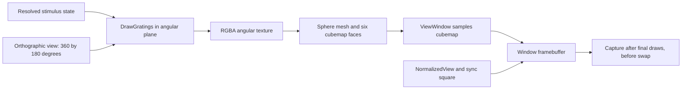

# VR03: rendering and control semantics

Date: **2026-09-20**. Status: **static source trace complete; pixel and timing fidelity unverified**.

This document traces the exact reference selected in the [source lock](ibl-renderer-sources.lock.json): IBLRIG `a0a031e2f9969c192767a255781920028034b7b0`, BonVision `85992cb492998bfa83e0e6d12d2b37d67df6f2c6`, and Bonsai `68f44e7a53c5553631f4d87981a3c748352d4abf`. It supplies the implementation semantics for VR05–VR09. It does not establish that these revisions were used by any configured recording session, or replace VR10's original-frame comparison.

The [replay specification](ibl-source-based-visual-replay-spec.md) lists intended protocol parameters. The traced implementation contains additional conversions and behaviors: a sigma input is not directly the Gaussian's final displayed sigma, saved and dynamically mapped phases take different conversion paths, and receipt of an angle parameter does not imply that it affects rendering. Preserve these distinctions rather than silently substituting a textbook Gabor.

## 1. Parameter and control inputs

The selected [IBL workflow][ibl-workflow] uses the `bpod` transport in [Osc.config][osc]: local UDP port 7110, remote host 127.0.0.1, remote port 0. Trial parameters are sampled through `SampleOnRenderFrame` before updating named subjects. These are state updates, not a frame-indexed command queue. The [Python sender][base-tasks] sends separate messages per parameter, not an atomic trial bundle; command arrival, graph application, displayed pixels, and synchronized ALF time must remain distinct.

| OSC input | Type | Graph destination / conversion | Meaning and limitation |
| --- | --- | --- | --- |
| `/t` | integer | `TrialNum` | Trial identifier for logging; raw-to-ALF row mapping remains VR05 work |
| `/p` | integer | `InitPosition` | Initial horizontal coordinate in the angular source plane, normally -35 or +35 degrees |
| `/c` | float | `Contrast` | Trial contrast fraction; becomes `StimContrast` on show event 8 |
| `/f` | float | `StimFreq` → DrawGratings.SpatialFrequency | Cycles per source angular degree |
| `/a` | float | `StimAngle` | Received and logged, but no active edge maps it to DrawGratings.Angle in this graph |
| `/s` | float | square → `StimSize` | Task field is `stim_sigma`; the downstream radius/aperture conversion is described below |
| `/g` | float | `Gain` | Visual degrees per wheel-surface mm, signed for reversed contingency |
| `/h` | float | RadianToDegree → `StimPhase` → DrawGratings.Phase | Python sends radians; dynamic property assignment has the source-specific conversion behavior below |
| `/re` | integer | multicast into `BpodEvent` | Alternative event ingress; unlike parameter paths, this branch is not render-frame sampled |
| `/x` | integer | SampleOnUpdateFrame → workflow termination | Ends the workflow, rather than just hiding the stimulus |

The sender's active protocol dictionary has no `/r` reverse command: `send_trial_info_to_bonsai` negates `stim_gain` when `stim_reverse` is true. Its surrounding documentation mentions `/e` and `/r`, but the selected graph listens for `/re`, not `/e`. Use executable paths and graph edges rather than those comments as the interface authority. The `BpodOverrides` group is disabled; its example constants are not active defaults. [Sender and gain inversion][base-tasks].

Normal hardware task events are sent as `'#'` plus event code through the rotary-encoder module. In the Bonsai graph, `EncoderEvent` selects its data, casts it to float, and samples it on render frames before publishing `BpodEvent`. `/re` reaches the same subject via a different timing path. Replacing serial events with OSC is therefore an explicit timing adaptation. [Hardware action definitions][hardware]; [IBL workflow][ibl-workflow].

## 2. Display mapping and capture boundary



The arrows describe rendering dependencies; they are not a proposal to capture at every reactive notification. Several operations queue drawing work and framebuffer operators dispatch it internally.

| Stage | Traced behavior |
| --- | --- |
| Window | Requested 640 x 480, fullscreen, second display by default, VSync on, target 60 Hz, Gray clear color; also requests stereo/four buffers. These requests do not establish the realized framebuffer or scanout format. |
| Resource state | BonVisionResources enables blending and depth testing, sets `SrcAlpha / OneMinusSrcAlpha` blending and `Lequal` depth comparison. |
| OrthographicView | Source plane spans x = [-180, 180], y = [-90, 90], near/far = [-500, 500]. Coordinates are angular values, not final display pixels. |
| Draw subject | The angular projection is published to the grating-draw branch. It builds a transformed finite quad and queues the grating draw. |
| SphereMapping: texture | Renders queued angular content to an RGBA texture, gray-cleared. Width/height default to the actual window dimensions. Uses linear filtering and repeat wrapping. |
| SphereMapping: mesh | Reconstructs angular bounds from the orthographic matrix. CreateSphereGrid uses 180 latitude rings and 360 longitude segments, mapping source-plane texture coordinates to a sphere. MeshMap samples the 2-D texture. |
| SphereMapping: cubemap | Generates six 90-degree views from the origin and renders one face per generated view; emits after all six. Default face size is max(actual window width, actual window height). Cube format is RGB; filtering is linear and wrapping clamps to edges. Six faces do not mean six display frames. |
| ViewWindow | Samples the cubemap through a plane of width 20, height 15, translation (0, 0, -7), rotation zero, using the SphereMap shaders and ViewportQuad. |
| NormalizedView | Sets a separate screen-space orthographic projection, x = ±aspect ratio and y = ±1, for the synchronization square. It does not remap the grating again. |
| Final window | Contains the mapped stimulus plus the synchronization square after their final draws. This is the original display-image boundary. The proposed mouse-scene renderer must place this image on its screen plane without repeating the BonVision mapping. |

Sources: [IBL graph][ibl-workflow], [resource state][resources], [OrthographicView][ortho], [SphereMapping][sphere], [CreateSphereGrid][grid], [ViewWindow][view], [NormalizedView][normalized], [RenderTexture][render-texture], [RenderCubemap][render-cube], [CreateCubemapCamera][cube-camera].

`RenderTexture` and `RenderCubemap` bind their own framebuffers, clear, dispatch queued shaders, restore the viewport, and bind framebuffer 0 again. `ShaderWindow.OnRenderFrame` clears, applies pending updates, emits render callbacks, then performs the final shader dispatch before swapping. A raw render callback is therefore not a guaranteed final-frame capture point. Capture must identify the realized default draw/read buffer, occur after ViewWindow and sync-square drawing, and associate the captured pixels with the state that produced them. Intermediate angular textures and cubemaps are not display screenshots. [ShaderWindow][window]; [ReadPixels][readpixels].

`ReadPixels` reads a three-channel 8-bit image and vertically flips it; absent an explicit input it samples one update event. It does not establish a complete frame sequence, the required post-draw ordering, or RGB channel order for an encoder. Preserve and verify the pixel packing/channel conversion when implementing capture. No runtime capture was obtained in [VR02](ibl-renderer-feasibility.md).

## 3. Geometry, coordinate signs, and expected positions

At the default zero rotation, the ViewWindow shader samples a ray proportional to `(10*n_x, 7.5*n_y, -7)`, where `n_x,n_y` are viewport coordinates in [-1,1]. Its dimensions and translation are in consistent scene units; the source describes them as metric units but does not establish a centimetre calibration for a recorded session. A uniform scaling of all these values leaves the rays unchanged. [ViewWindow][view]; [SphereMap shaders][sphere-shader]; [ExtrinsicsTransform][extrinsics].

From CreateSphereGrid, the ideal continuous direction at angular azimuth `a` and elevation `e` is `(cos(e)*sin(a), sin(e), -cos(e)*cos(a))`. Thus zero azimuth faces -Z; positive azimuth projects right; positive elevation projects upward. For the nominal plane, measured from the top-left image boundary:

```text
u = 1/2 + (7/20) * tan(a)
v = 1/2 - (7/15) * tan(e) / cos(a)
x = image_width * u
y = image_height * v
```

Angles in these trigonometric expressions are radians. For the horizontal centerline, `e=0` and `v=1/2`. Pixel-center index conventions introduce the usual half-pixel distinction from these continuous image-boundary coordinates.

| Azimuth | Normalized x | x at hypothetical 640-wide framebuffer | y at 480 high |
| --- | ---: | ---: | ---: |
| -35 degrees | 0.25492736 | 163.1535 | 240 |
| 0 degrees | 0.5 | 320 | 240 |
| +35 degrees | 0.74507264 | 476.8465 | 240 |

These are **derived geometric expectations**, not measured capture coordinates or pixel-exact tolerances. The actual pipeline includes finite sphere tessellation, angular-texture resolution, cubemap rasterization, interpolation, and quantization. The nominal horizontal span is `2*atan(10/7) ≈ 110.01596 degrees`; the vertical centerline span is `2*atan(7.5/7) ≈ 93.94987 degrees`. This is not the publication's approximate 102-degree physical coverage. A source-faithful port must not replace the source geometry with that approximate value.

The IBL `CalibrationVariables` group computes `VisualSpan = 2*degrees(atan((ScreenWidth/2)/abs(TranslationZ)))`. It supplies this span to both grating extents; height remains independently relevant to ViewWindow. Offscreen centers, including ±70 degrees with this nominal plane, can leave visible tails and are clipped by the final viewport. There is no generic inward-only clamp. The finite source quad also has its own boundaries. [IBL graph][ibl-workflow].

## 4. Grating, phase, aperture, and blending

### Carrier and orientation

The mesh `Quad.obj` spans ±0.5 in x/y with texture coordinates [0,1]. DrawGratings scales it by extents and translates it by location. For extent values `Lx,Ly`, texture coordinates `u,v`, frequency `f`, and internal angle `theta`, its frequency uniform is `(Lx*f*cos(theta), Ly*f*sin(theta))`. The sine argument in cycles is `(u-0.5)*Fx + (v-0.5)*Fy + phase_uniform`. At angle zero the intensity varies horizontally, producing vertical bars. The selected graph fixes DrawGratings.Angle to zero: the active `StimAngle` subject is only logged, not connected to this property. Applying arbitrary recovered `/a` values to the carrier would change this selected workflow's behavior. [DrawGratings][grating-workflow]; [grating shaders][grating-shader]; [IBL graph][ibl-workflow].

### Phase: saved properties differ from numeric mappings

BonVision `AngleProperty.Value` is a radians-valued runtime float. Its XML proxy `ValueXml` and editor converter expose degrees. Bonsai's IncludeWorkflow deserialization uses the serializable proxy for XML settings; dynamic `PropertyMapping` instead follows the externalized mapping to the runtime property and assigns the numeric value directly, without applying its degree converter. [AngleProperty][angle]; [DegreeConverter][degree]; [IncludeWorkflowBuilder][include]; [ExpressionBuilder.BuildPropertyMapping][mapping].

DrawGratings divides the runtime phase value by `2*pi`, then subtracts it from accumulated temporal cycles. For a saved phase of 90 degrees, the runtime value is pi/2 and the zero-temporal-frequency phase uniform is -1/4 cycle.

The **dynamic IBL path is different**: `/h` contains the Python task phase in radians; the graph first applies RadianToDegree and maps that resulting number directly into the radians-valued property. If the incoming value is `p`, the statically derived chain is:

```text
received p radians
→ q = p * 180/pi
→ AngleProperty.Value = q (numeric runtime assignment)
→ phase_uniform = accumulated_temporal_cycles - q/(2*pi)
→ sine argument at temporal frequency zero includes -q radians
```

For example, an incoming pi/2 gives a runtime value of approximately 90 and phase uniform approximately -14.32394 cycles, rather than -0.25. This is a **source-derived conversion discrepancy**, not a measured phase error in a recorded session. It requires explicit original-renderer comparison in VR10. Do not silently correct it in a port, and do not confuse the recovered task phase with the effective shader phase. Keep both values and the chosen backend conversion in provenance. The selected workflow sets temporal frequency to zero, so wheel movement translates a static carrier rather than adding independent temporal drift.

### Sigma and aperture

Let `s` be the numeric `/s` input, `V` the computed VisualSpan, and `q=s*s/V`. The selected graph sets **both** `Radius=q` and `Aperture=q`, and both extents to `V`. The fragment shader computes:

```text
d = length(2*texture_coordinate - 1) / Radius
E = exp(-0.5 * (d/Aperture)^2)       # when Aperture is nonzero
source_rgb = 0.5 + 0.5 * contrast * E * carrier
source_alpha = opacity * E
```

At aperture zero, the shader instead uses a hard disk (`d<1`); this is not the standard `/s=7` branch. For the square extent, the **shader envelope alone** corresponds algebraically to angular sigma `V*Radius*Aperture/2 = s^4/(2*V)`. For `s=7` and nominal `V`, this is about **10.91205 degrees**. This is an intermediate mathematical result, not a replacement protocol sigma. The protocol field remains `stim_sigma=7`; its interpretation must preserve the source transformations. [IBL graph][ibl-workflow]; [grating shader][grating-shader].

### Contrast, alpha, and gray

Contrast is a fractional multiplier, but final pixels also depend on the envelope and blending. The IBL graph sets opacity to zero for `StimContrast <= 0.01` and to one for `StimContrast > 0.01`. Thus zero and sufficiently small positive contrasts hide the patch entirely. The standard nonzero contrast set is above this threshold. Hide event 1 writes zero to StimContrast; the trial Contrast subject remains available for a later show event.

BonVisionResources applies `GL.BlendFunc(SrcAlpha, OneMinusSrcAlpha)` to color **and alpha**. With normalized gray `g=128/255`, opacity 1, and opaque gray behind the grating, the ideal first-pass RGBA result is:

```text
C1 = g + E*(0.5-g) + 0.5*contrast*carrier*E^2
A1 = E^2 + (1-E)
```

MeshMap subsequently samples that RGBA texture into a gray-cleared RGB cubemap with blending still enabled. Ignoring intermediate interpolation/quantization, its color is `C2 = g + A1*(C1-g)`. ViewWindow then samples the RGB cubemap. The texture's interpolated alpha is relevant: this pipeline is not just a single conventional Gaussian multiplication. Even the carrier's `E^2` in the first pass would give an approximately 7.71599-degree envelope before the additional cubemap blend, and the complete response is not a single Gaussian. [Resource blend state][resources]; [BlendFunctionState][blend]; [RenderTexture][render-texture]; [RenderCubemap][render-cube]; [MeshMap shader][mesh-shader].

The shader midpoint 0.5 differs slightly from normalized 8-bit Gray, 128/255. Preserve this distinction, the intermediate formats/filtering, and saturation/quantization rather than imposing `128 + 127*contrast*sin(...)`. A hidden grating leaves the gray background, **except for the separately drawn synchronization square**. No active gamma-correction stage was found; loading a Gamma shader resource is not applying it.

## 5. Wheel conversion and controller timing

The RotaryEncoder group rescales raw position counts from [-512,512] to [-180,180] degrees, i.e. `encoder_degrees = count*360/1024`, then samples them on render frames. The GainConverter's nested edges compute wheel mm/degree as `2*pi*31/360`, multiply it by signed gain, invert that product, then divide encoder degrees by the reciprocal. Despite intermediate node names and comments, the resulting displacement is:

```text
delta_visual_deg = encoder_degrees * (2*pi*31/360) * signed_gain_deg_per_mm
                = encoder_radians * 31 * signed_gain_deg_per_mm
```

The nominal standard magnitude is 124 visual degrees per encoder radian. The raw graph **adds** displacement to initial azimuth, using `((delta + initial + 180) % 360) - 180`. `%` is the C# remainder operation; Python's modulo differs for negative dividends. Preserve the source behavior outside the usual task range instead of assuming mathematically normalized angles. [IBL graph][ibl-workflow].

There is no subtraction of wheel position at stimulus onset in this graph. The controller resets the hardware encoder before quiescence and again after the auditory cue, then waits 0.05 seconds before entering closed loop. `stim_on` first shows the stationary stimulus; `INTERACTIVE_DELAY`, tone detection/timer, and the second reset precede `closed_loop`. A zero configured interactive delay does not eliminate all these distinct states. [Controller state machine][controller].

For an ALF wheel series, recover the corresponding reset/reference and sign convention before converting it into this raw encoder coordinate. The existing ViNED rule `initial - gain*radius*(ALF_wheel(t)-ALF_wheel(stimOn))` is not established by this graph: it uses processed-wheel sign and onset reference assumptions. Source inspection establishes raw graph units/sign, not the session-specific transformation from an extracted wheel array. VR04/VR05 must recover that mapping or label the approximation explicitly.

Hardware threshold configuration scales task angular thresholds by its configured wheel diameter/gain, while this selected Bonsai graph's gain conversion contains a radius value of 31. Do not assume both match every rig. Reverse contingency negates the transmitted gain; do not also negate the trajectory. [RotaryEncoderModule][hardware]; [sender][base-tasks].

### Event effects

| Code | Active graph effect | Controller interpretation / caveat |
| --- | --- | --- |
| 1 | Set StimContrast to zero; update sync square | Hide/offset; no-go also hides. Does not itself encode a response time. |
| 8 | Sample InitPosition into StimLocationX, then take trial Contrast into StimContrast; update sync square | Show stimulus at initial position; does not start wheel coupling. |
| 3 | Create a closed-loop observable; Switch subscribes to the latest such loop | Start encoder-driven motion. Uses already reset hardware position; no local baseline subtraction. |
| 4 | Stop the closed-loop subscription; update sync square | Freeze at last assigned position. No explicit snap to an error threshold. |
| 9 | Assign zero to StimLocationX, update sync square, and stop closed loop | Freeze at center on reward; different from merely holding the last wheel sample. |
| 5 | Assign zero to StimLocationX and update sync square | Show-center command; does not by itself stop an existing closed loop or restore contrast. |

The controller sends these codes via its named hardware actions. Closed-loop termination also occurs when `abs(initial) - abs(delta) < 0`, i.e. strictly after displacement magnitude exceeds the initial-position magnitude. The graph does not clamp to the center or error threshold; it holds its last assignment when the subscription stops. Position writes occur upstream of TakeUntil, so the exact boundary frame when movement and stop notifications coincide depends on event ordering and must be validated rather than inferred from a clamp. [IBL event graph][ibl-workflow]; [hardware actions][hardware].

The pinned controller maps error to event 4, reward to event 9, and no-go to hide event 1. Stimulus offset follows outcome-dependent states; feedback and freeze are not interchangeable. Capture/reconstruction must retain the distinction between an event command and its measured display transition. Serial event timestamps, host log timestamps, and ALF/session seconds require explicit synchronization; CSV writes are not photodiode observations. Protocol variants in the same repository can have different state sequences and remain a VR04 session-version question.

## 6. Synchronization square and final-frame policy

After ViewWindow, NormalizedView draws a layer-1 quad with extent (0.2,0.2), center approximately (1.23333335,-1), angle zero, alpha one. Its RGB channels are driven by an accumulated update counter modulo two; `UpdateSyncSquare` has an initial value and receives hide/show, motion, and stop/center updates through the event graph. This is an event-driven marker, not a guaranteed alternating square on every refresh. At nominal 4:3 aspect it is at the lower-right edge and partly clipped. [IBL graph][ibl-workflow]; [NormalizedView][normalized]; [DrawQuad][quad].

A faithful full-frame reference includes this square. Removing or masking it for model input is a separate, explicitly recorded transformation; do not call that altered image the untouched source framebuffer. Similarly, do not fabricate a marker sequence from trial outcome alone when the source event sequence is missing. The digital gray-background requirement applies away from the marker and visible stimulus.

## 7. Implementation handoff and verification

| Task | Required consequence of this trace |
| --- | --- |
| VR05 | Preserve raw task values and provenance separately from effective shader values. Recover encoder reset/coupling timing, processed-wheel sign, signed gain, and event source. |
| VR06–VR07 | Represent stationary visible, closed-loop, freeze-in-place, freeze-at-center, hidden, and terminated states distinctly; retain command versus display timestamps. |
| VR09 | Reproduce the pinned phase, sigma/aperture, blend, opacity threshold, fixed-angle, finite-quad, projection, and sync-square paths. Any correction to intended protocol behavior must be named and recorded as a deviation. |
| VR10 | Compare nonzero phase, nonzero supplied angle, sigma/envelope tails, low-contrast threshold, ±35/0 positions, both movement signs, threshold crossing, both freeze types, and marker states against original output. Do not certify these static derivations as measured fidelity. |
| VR11–VR12 | Keep source scene units separate from a physical rig profile; place the final mapped framebuffer on the scene's screen once. |

Validation performed: inspected graph node indices and edge source ordering, traced operator implementations rather than relying on node labels, independently calculated the nominal coordinate/envelope examples, and verified all 93 locked source blobs from the downloaded pinned archives against their Git blob hashes. Additional controller and Bonsai helper files are read from the same immutable commits linked below. No renderer code, tests, or CI/CD configuration were added or changed.

Static source claims are complete for VR03. Runtime scheduling at coincident notifications, actual framebuffer dimensions/precision, DLL-resource equivalence, session-version applicability, and original-pixel agreement remain unverified; the VR02 failure and VR10 requirement remain unchanged.

[ibl-workflow]: https://github.com/int-brain-lab/iblrig/blob/a0a031e2f9969c192767a255781920028034b7b0/visual_stim/GaborIBLTask/Gabor2D.bonsai
[osc]: https://github.com/int-brain-lab/iblrig/blob/a0a031e2f9969c192767a255781920028034b7b0/visual_stim/GaborIBLTask/Osc.config
[base-tasks]: https://github.com/int-brain-lab/iblrig/blob/a0a031e2f9969c192767a255781920028034b7b0/iblrig/base_tasks.py
[controller]: https://github.com/int-brain-lab/iblrig/blob/a0a031e2f9969c192767a255781920028034b7b0/iblrig/base_choice_world.py
[hardware]: https://github.com/int-brain-lab/iblrig/blob/a0a031e2f9969c192767a255781920028034b7b0/iblrig/hardware.py
[resources]: https://github.com/bonvision/BonVision/blob/85992cb492998bfa83e0e6d12d2b37d67df6f2c6/BonVision/Primitives/BonVisionResources.bonsai
[ortho]: https://github.com/bonvision/BonVision/blob/85992cb492998bfa83e0e6d12d2b37d67df6f2c6/BonVision/Environment/OrthographicView.bonsai
[sphere]: https://github.com/bonvision/BonVision/blob/85992cb492998bfa83e0e6d12d2b37d67df6f2c6/BonVision/Environment/SphereMapping.bonsai
[grid]: https://github.com/bonvision/BonVision/blob/85992cb492998bfa83e0e6d12d2b37d67df6f2c6/BonVision/CreateSphereGrid.cs
[view]: https://github.com/bonvision/BonVision/blob/85992cb492998bfa83e0e6d12d2b37d67df6f2c6/BonVision/Environment/ViewWindow.bonsai
[normalized]: https://github.com/bonvision/BonVision/blob/85992cb492998bfa83e0e6d12d2b37d67df6f2c6/BonVision/Environment/NormalizedView.bonsai
[sphere-shader]: https://github.com/bonvision/BonVision/blob/85992cb492998bfa83e0e6d12d2b37d67df6f2c6/BonVision/Shaders/SphereMap.vert
[grating-workflow]: https://github.com/bonvision/BonVision/blob/85992cb492998bfa83e0e6d12d2b37d67df6f2c6/BonVision/Primitives/DrawGratings.bonsai
[grating-shader]: https://github.com/bonvision/BonVision/blob/85992cb492998bfa83e0e6d12d2b37d67df6f2c6/BonVision/Shaders/Gratings.frag
[mesh-shader]: https://github.com/bonvision/BonVision/blob/85992cb492998bfa83e0e6d12d2b37d67df6f2c6/BonVision/Shaders/MeshMap.frag
[angle]: https://github.com/bonvision/BonVision/blob/85992cb492998bfa83e0e6d12d2b37d67df6f2c6/BonVision/AngleProperty.cs
[degree]: https://github.com/bonvision/BonVision/blob/85992cb492998bfa83e0e6d12d2b37d67df6f2c6/BonVision/DegreeConverter.cs
[quad]: https://github.com/bonvision/BonVision/blob/85992cb492998bfa83e0e6d12d2b37d67df6f2c6/BonVision/Primitives/DrawQuad.bonsai
[include]: https://github.com/bonsai-rx/bonsai/blob/68f44e7a53c5553631f4d87981a3c748352d4abf/Bonsai.Core/Expressions/IncludeWorkflowBuilder.cs
[mapping]: https://github.com/bonsai-rx/bonsai/blob/68f44e7a53c5553631f4d87981a3c748352d4abf/Bonsai.Core/Expressions/ExpressionBuilder.cs
[render-texture]: https://github.com/bonsai-rx/bonsai/blob/68f44e7a53c5553631f4d87981a3c748352d4abf/Bonsai.Shaders/RenderTexture.cs
[render-cube]: https://github.com/bonsai-rx/bonsai/blob/68f44e7a53c5553631f4d87981a3c748352d4abf/Bonsai.Shaders/RenderCubemap.cs
[cube-camera]: https://github.com/bonsai-rx/bonsai/blob/68f44e7a53c5553631f4d87981a3c748352d4abf/Bonsai.Shaders/CreateCubemapCamera.cs
[extrinsics]: https://github.com/bonsai-rx/bonsai/blob/68f44e7a53c5553631f4d87981a3c748352d4abf/Bonsai.Shaders/ExtrinsicsTransform.cs
[blend]: https://github.com/bonsai-rx/bonsai/blob/68f44e7a53c5553631f4d87981a3c748352d4abf/Bonsai.Shaders/Configuration/BlendFunctionState.cs
[window]: https://github.com/bonsai-rx/bonsai/blob/68f44e7a53c5553631f4d87981a3c748352d4abf/Bonsai.Shaders/ShaderWindow.cs
[readpixels]: https://github.com/bonsai-rx/bonsai/blob/68f44e7a53c5553631f4d87981a3c748352d4abf/Bonsai.Shaders/ReadPixels.cs
